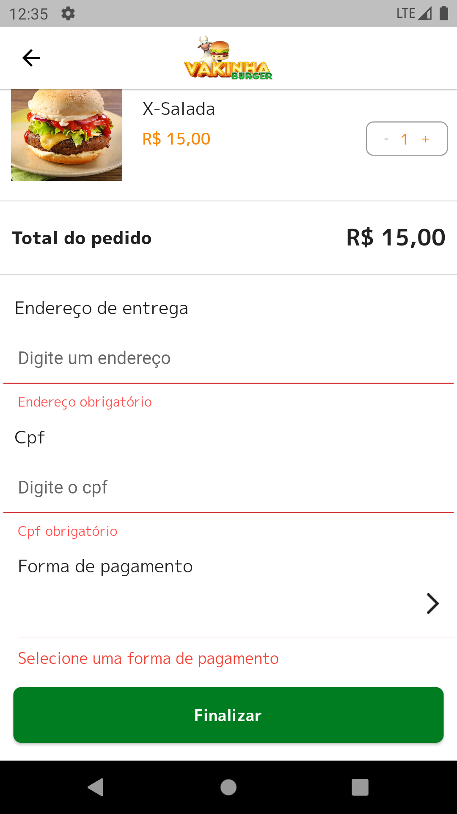
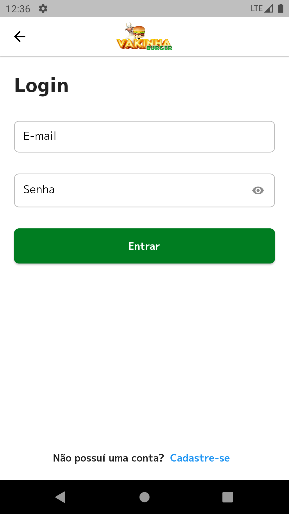

    

<h1 align="center">Vakinha Burger</h1>

<h2>📖 Sobre</h2>

    Este projeto foi desenvolvido durante a semana do Dart Week em sua 9º edição. um evento realizado pela <a href="http://academiadoflutter.com.br/">Academia do Flutter (ADF)</a> com o professor <a href="https://github.com/rodrigorahman">Rodrigo Rahman</a>.  

 

<h2>💻 Tecnologia utilizada</h2>
 - Dart
 - Flutter

  

<h2>🛠️ Packages utilizados</h2>
- Dio
- Provider
- Bloc
- Flutter Bloc
- Intl
- Loading animation Widget
- Top Snackbar Flutter
- Equatable
- Match
- Validatorless
- Auto Size Text
- Shared Preferences
- Flutter Awesome Select
- Flutter Lints
- Match Generator
- Build Runner

 

<h2>🖥 BackEnd</h2>
<a href="https://pub.dev/packages/json_rest_server">Json Rest Server</a>

 

<h2>📱 Screenshots</h2>

    
    
    
    
    
    
    
    

<h2>📝 Licença</h2>

   Esse repositório está sobre a Licença MIT, e você pode vê-la no arquivo <a href="https://github.com/cassianolucas/dart_week/blob/main/LICENSE">LICENSE</a> para mais detalhes.

